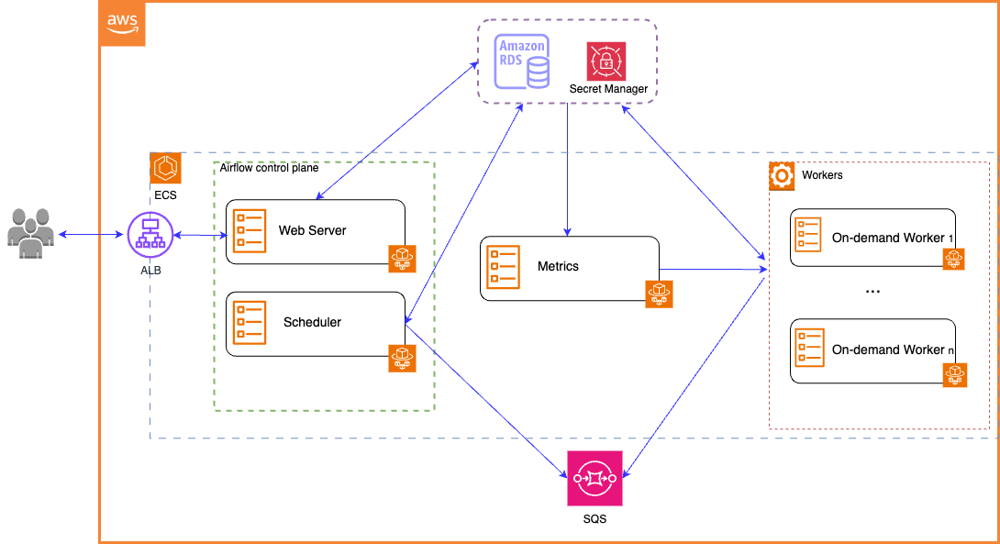

# Self Managed Apache Airflow (SM2A) Design Document

## Introduction

Self Managed Apache Airflow (SM2A) is a scalable and robust workflow automation platform that allows users
to programmatically author, schedule, and monitor workflows.
This document outlines the architecture and design considerations for deploying SM2A on AWS infrastructure.

## Architecture Overview

The SM2A architecture consists of the following key components:

- Application Load Balancer (ALB): Provides a single point of access to the Airflow webserver, 
distributing incoming traffic across multiple instances to ensure high availability and scalability.
- Scheduler with Celery and SQS: Utilizes Celery as the distributed task queue and SQS (Simple Queue Service) as
the message broker for coordinating task execution across multiple worker nodes. The scheduler is responsible for
determining when and how to execute tasks based on their dependencies and schedule.
- Metrics Task for Autoscaling: A custom metrics task is implemented to monitor system metrics such as task queue
length. This task dynamically adjusts the number of Airflow worker nodes based on workload demand to ensure optimal
resource utilization and performance.
- AWS Secret Manager: Stores sensitive data such as database credentials, API keys, and other configuration
parameters required by various Airflow services. Secrets are securely retrieved by Airflow components at runtime,
reducing the risk of exposing sensitive information.
- Amazon RDS (Relational Database Service): Hosts the SM2A metadata database, which stores workflow definitions,
task states, and execution logs. RDS provides a managed database service that offers high availability, automatic
backups, and scalability to accommodate growing workloads.

## Deployment Architecture
- VPC (Virtual Private Cloud): All SM2A resources are deployed within a VPC to isolate them from the public internet and
ensure network security.
- Subnets: Public and private subnets within the VPC are used to segregate resources based on their accessibility
requirements. The ALB resides in the public subnet to handle incoming HTTP requests,
while the scheduler, workers, and RDS instance are deployed in private subnets for enhanced security.
- Security Groups: Security groups are configured to control inbound and outbound traffic to SM2A components.
For example, the ALB security group allows inbound traffic on port 443 (HTTPS) from the internet, 
while the RDS security group restricts database access to SM2A components only.
- Application Load Balancer: An Application Load Balancer (ALB) is provisioned to distribute incoming HTTP requests to 
the Airflow webserver running as an ECS Fargate task. The ALB supports SSL termination, sticky sessions, and health
checks to ensure reliable and secure access to the web interface.
- ECS Fargate tasks: ECS Fargate are launched in the private subnet to host the Airflow scheduler and worker nodes. 
Each task instance is configured with the necessary software packages, including Python, Celery,
and the Airflow runtime environment. 
A custom auto Scaling approach is used to automatically scale the number of worker nodes based on workload demand,
as determined by the metrics task.
- SQS Queue: An SQS queue is created to serve as the message broker for Celery, facilitating communication between
the scheduler and worker nodes. Celery workers poll the SQS queue for new tasks, execute them asynchronously,
and report task status back to the scheduler.
- AWS Secret Manager: Secrets such as database credentials, and Airflow admin credentials are stored securely in AWS
Secret Manager. Airflow components retrieve secrets from Secret Manager using AWS SDKs or APIs at runtime,
eliminating the need to hardcode sensitive information in configuration files or environment variables.
- Amazon RDS: An RDS instance running PostgreSQL or MySQL is provisioned to host the Airflow metadata database.
RDS offers managed database services such as automated backups, snapshots, and multi-AZ replication for high 
availability and fault tolerance. The Airflow metadata database stores workflow definitions,
task instances, and execution logs, enabling users to track workflow progress and troubleshoot issues.
- Airflow Logs: Airflow generates execution logs, task logs, and DAG run logs, which are stored in a centralized
location (e.g., Amazon S3) for analysis, troubleshooting, and historical reference.
